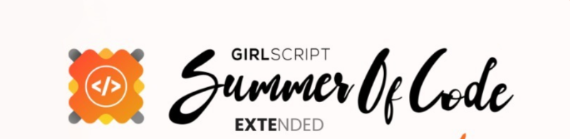

<table align="center">
    <thead align="center">
        <tr>
            <td><b>🌟 Stars</b></td>
            <td><b>🍴 Forks</b></td>
            <td><b>🐛 Issues</b></td>
            <td><b>🔔 Open PRs</b></td> 
            <td><b>🔕 Closed PRs</b></td>
        </tr>
     </thead>
    <tbody>
         <tr>
            <td></td>
            <td></td>
            <td></td>
            <td></td>
            <td></td>
        </tr>
    </tbody>
</table>

# Stark Tech Portfolio

🌟 **Overview** 🌟

Welcome to the Stark Tech Portfolio, a tribute to the legendary Tony Stark! This cutting-edge portfolio mirrors the innovation and futuristic flair of Stark Industries, blending sleek design with powerful functionality. Dive into a showcase of projects, skills, and experiences, all presented with the same high-tech, forward-thinking energy that defines Stark's genius.


## ✨ Key Features ✨

Inspired by Tony Stark, this portfolio is designed with cutting-edge technology and sleek, modern aesthetics to reflect the innovation and sophistication of Iron Man's world.

- 🚀 **High-Tech Interface**: Immerse yourself in a futuristic, high-tech design that draws inspiration from Stark Industries.
- 🎯 **Project Showcase**: A well-organized gallery that highlights your projects with precision and style, ensuring each one stands out.
- 🛠️ **Skills & Experience**: Interactive sections that make your skills and experiences pop, offering an intuitive way to explore your expertise.
- 📱 **Responsive Design**: Built to be fully responsive and seamlessly adaptable across all devices, ensuring a smooth experience whether on desktop or mobile.
- ✨ **Interactive Elements**: With engaging animations and smooth transitions, each interaction reflects the innovative spirit of Tony Stark, bringing your portfolio to life.

---


## 📋 Participating Programs

| Name                  | Logo                                                      | Purpose                                                                                                      |
|-----------------------|-----------------------------------------------------------|--------------------------------------------------------------------------------------------------------------|
| GSSoC'2024-Extd       |              | The coding period is from October 1st to October 30th, during which contributors make contributions and earn points on the platform. |
| Hacktoberfest 2024    |  | Hacktoberfest is a month-long October event welcoming all skill levels to join the open-source community.     |

---

## 🛠 Tech Stack

- **HTML5**: The backbone of the web, defining the structure and layout of each page.
- **CSS3**: Styling the web with vibrant designs, responsive layouts, and animations to create a polished, user-friendly interface.
- **JavaScript**: Bringing life to the website with interactive elements, dynamic content updates, and enhanced user experiences.

## 🚀 How to Contribute to This Project 
-We’re thrilled that you’re interested in contributing to the Stark Tech Portfolio project! Follow these steps to get started: 

### 🍴 Fork the Repository 
1. Go to the Stark Tech Portfolio repository. 
2. Click the **Fork** button (top right) to create a copy in your GitHub account. 

### 💻 Clone Your Fork Open your terminal and run the following command to clone your forked repository: 
```
git clone https://github.com/your-username/WordWise.git
```

### 🌿 Create a New Branch 
Create a new branch for your contributions:

 ```
 git checkout -b your-branch-name
```


### 🛠️ Make Your Changes 
1. Open the project files in your preferred code editor. 
2. Make the necessary changes or add new features to the project. 

### ✅ Test Your Changes 
Test your changes locally by opening the `index.html` file in your browser to ensure everything works as expected. 

### 💬 Commit Your Changes Once you’ve made and tested your changes, commit them with a meaningful message: 
```
 git add . git commit -m "Added feature X or Fixed issue Y
```
### 📤 Push Your Changes
Push your changes to your forked repository:

```
git push origin your-branch-name
```

## 🔄 Create a Pull Request (PR)
1. Navigate back to the original Stark Tech Portfolio repository.
2. Click the **Compare & pull request** button.
3. Write a brief description of your changes and submit your PR.

## 🔎 Review Changes
Your pull request will be reviewed by the project maintainer.  
If approved, your changes will be merged into the main branch.

## 🏆 Contribution Points
All tasks will be assigned various levels based on complexity and required skills. Each level rewards different points:
- 🥇 **Level 1**: 10 Points
- 🥈 **Level 2**: 25 Points
- 🥉 **Level 3**: 45 Points

## GSSoC Guidelines
If you're contributing as part of **GirlScript Summer of Code (GSSoC)**, make sure to follow the event's guidelines to ensure your contributions count. Violations can affect your profile and standings. Please review the GSSoC Guidelines to stay on track. 


## Here is the Demo Link :
https://stark-tech-portfolio.vercel.app


## Contact Me 📧


Feel free to reach out if you have any questions or suggestions. **I'd Love to hear** ❤️:


- **My GitHub**: [https://github.com/aslams2020](https://github.com/aslams2020)
- **My LinkedIn**: [Aslam Sayyad](https://www.linkedin.com/in/aslamsayyad02/)


## 🌟 Star the Project


If you like this project, please give it a star on GitHub! ⭐


[](https://github.com/aslams2020/Stark-Tech-Portfolio)
<br>


## 📄 Ending Note
Thank you for exploring the Stark Tech Portfolio project! We hope you find it both exciting and informative. Your feedback, contributions, and suggestions are always appreciated and welcome! If you have any questions or need assistance, feel free to reach out through the Issues section of this repository. We're here to help you contribute in the best way possible.

## 🙌🏻 Join Us!
We encourage you to explore the website, contribute your ideas, and get involved in improving the project. Together, let's make this Stark Tech Portfolio even more innovative and powerful!

<div align="center">
    <a href="#header">
     <!--    -->
       
    </a>
</div>

---

## 🌟 Contributors

Thanks to these amazing contributors!

[](https://github.com/aslams2020/Stark-Tech-Portfolio/graphs/contributors)

---


